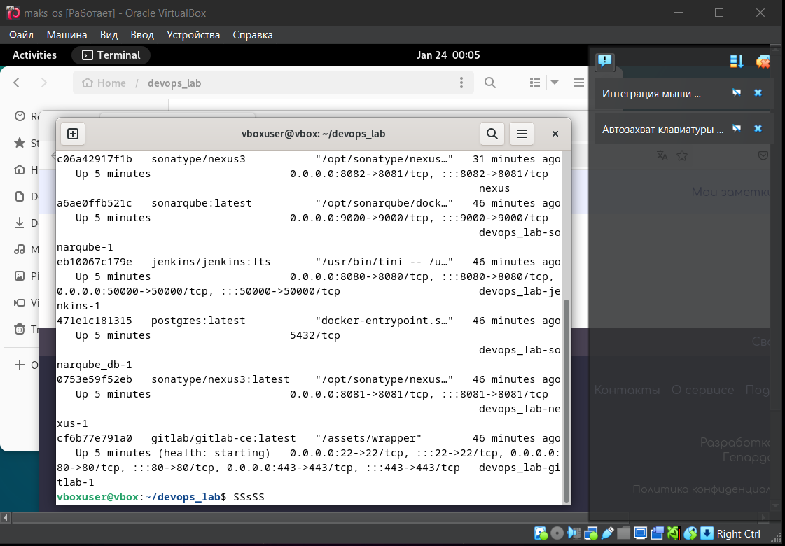
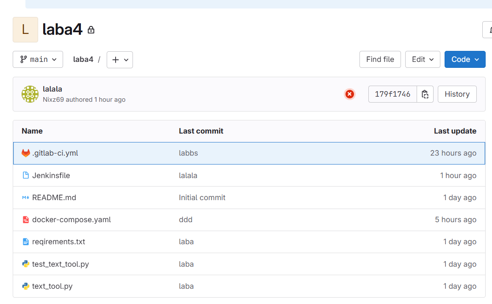
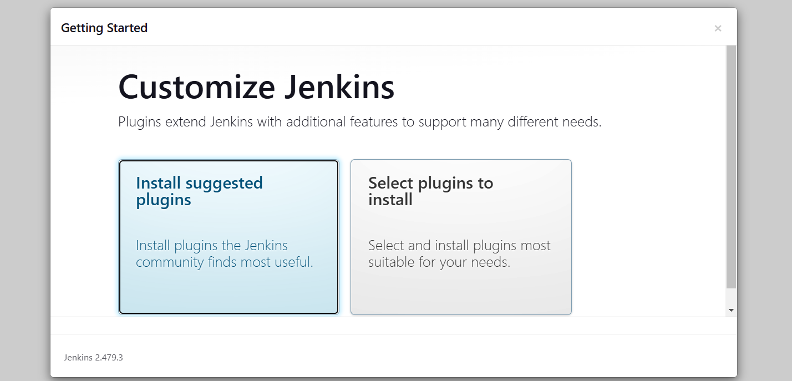
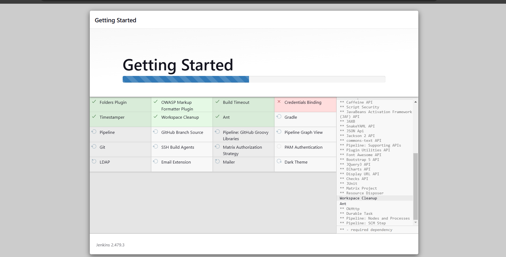
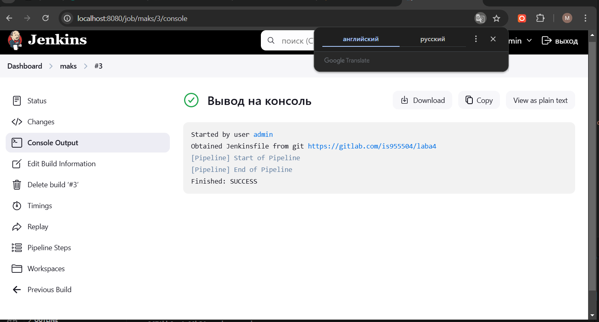
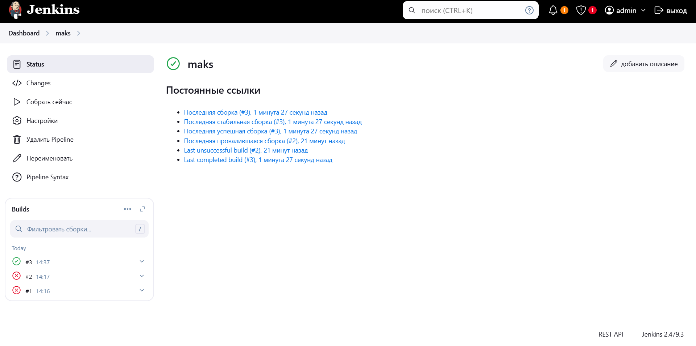
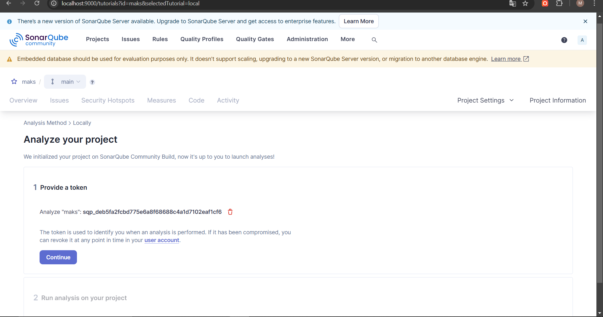

### **Задача 1. Подготовка окружения**  
1. Настроил `docker-compose.yaml` для сервисов:
   - **Jenkins**  
   - **GitLab**  
   - **SonarQube (с PostgreSQL)**  
   - **Nexus**  

### **Задача 2  
1. Создайте файл `text_tool.py`

2. Напишите модульные тесты в файле `test_text_tool.py`:  

3. Создайте файл `requirements.txt`

 Загрузил приложение и тесты в новый репозиторий GitLab.  

---

### **Задача 3. Интеграция инструментов**  
#### **GitLab CI/CD**  
1. Настройте `.gitlab-ci.yml`:  

#### **Jenkins**  
1. Настройте Jenkins Pipeline, который:  
   - Клонирует репозиторий.  
   - Выполняет тесты (`pytest`).  
   - Генерирует отчёт о покрытии тестами. 

### **Задача 4. Анализ кода с SonarQube**  

1. Настройте SonarQube для анализа Python-кода:  
   - Установите плагин для Python.  
   - Создайте проект в интерфейсе SonarQube.  
   - Получите ключ для интеграции.  

